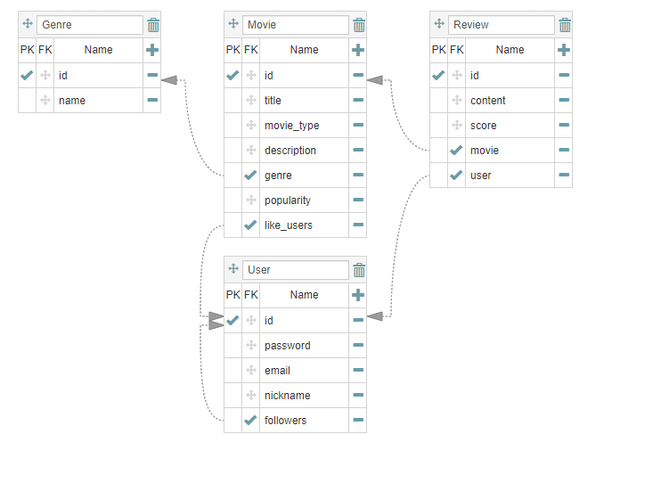
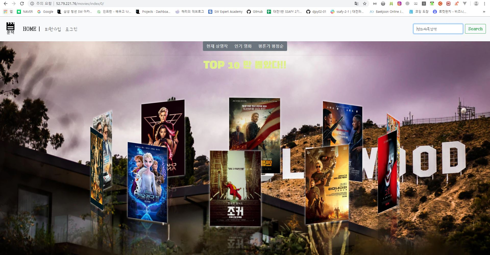
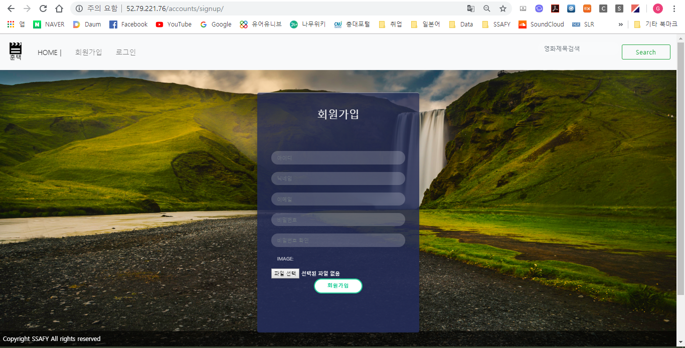
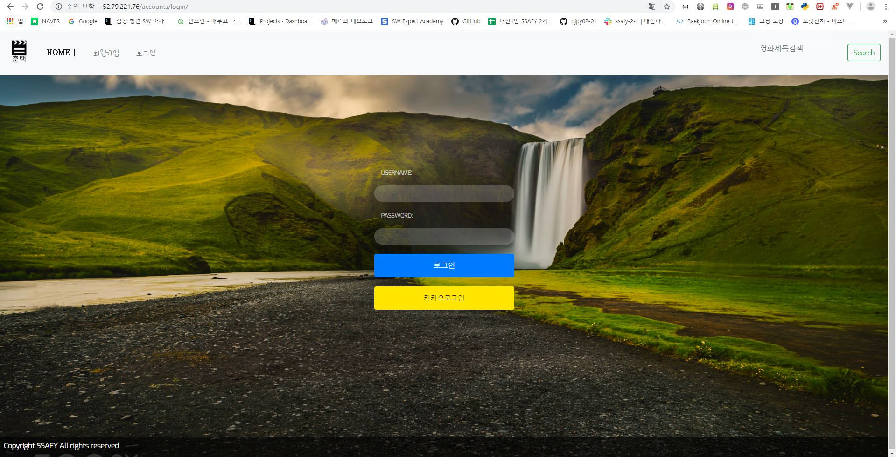
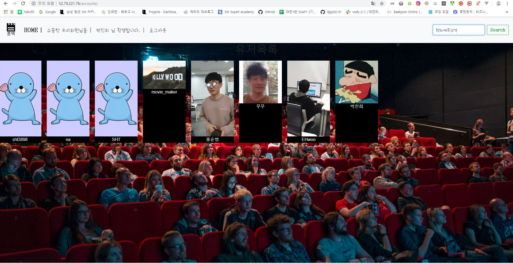
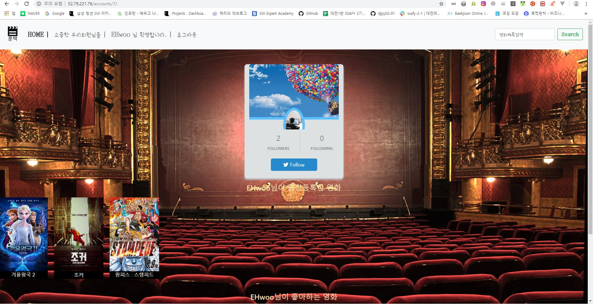
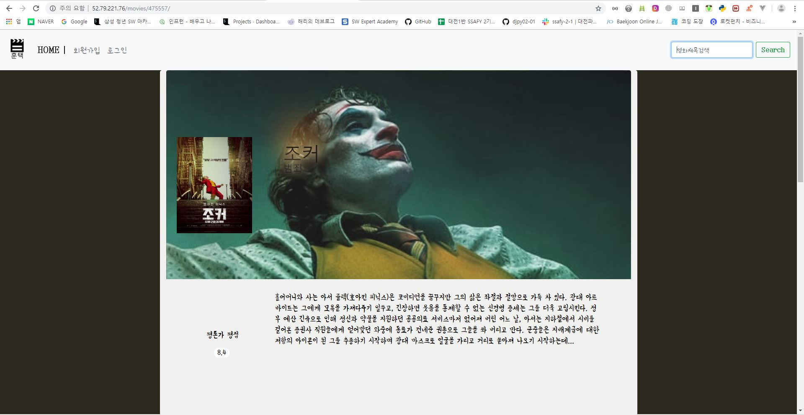
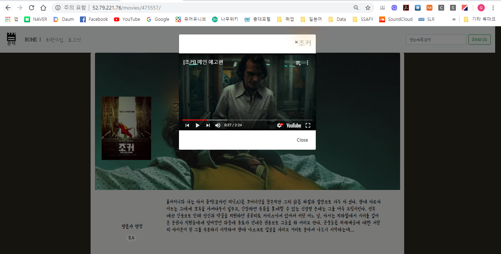
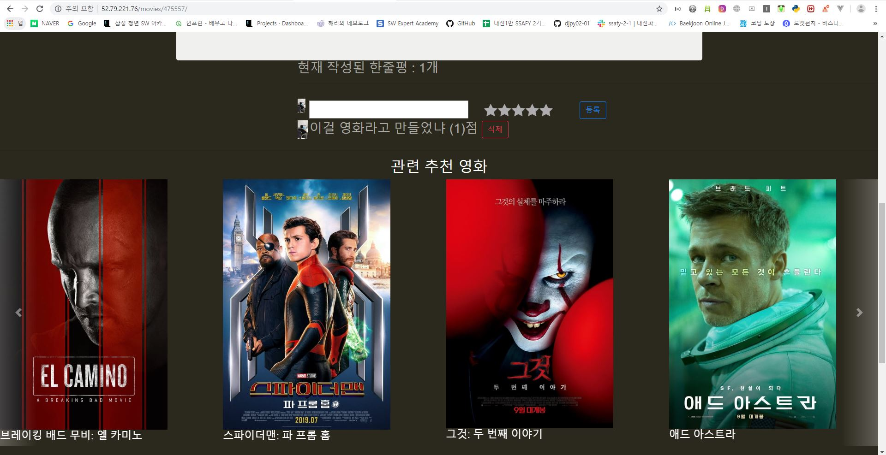
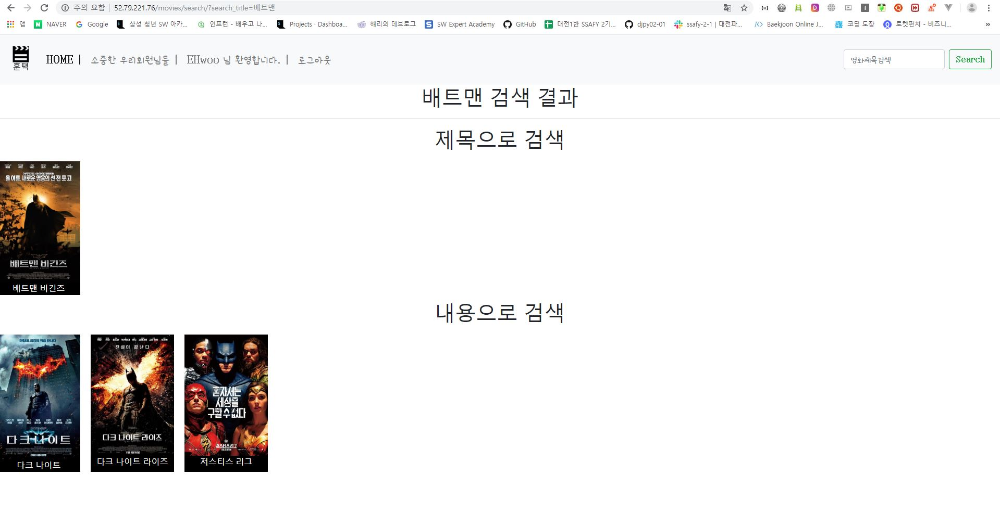

# 마지막 프로젝트

## 1. 팀원 정보 및 업무 분담 내역

팀명 - 훈택SCREEN

설명 - 각자의 이름에서 한 글자씩을 따와 훈훈 영화 선택하는 추천 사이트를 만들자는 뜻

김성훈 - 프론트엔드 담당, HTML, Javascript를 활용하여 영화 추천 사이트 구축

서현택 - 백엔드 담당, 영화 정보 수집


## 2. 목표 서비스 구현 및 실제 구현 정도

기본적인 기능들(영화 조회, 평점 등록, 영화 추천) - 완료

영화 검색 기능 추가 - 완료

영화 포스터를 누르면 유튜브 예고편 재생 - 완료


## 3. 데이터베이스 모델링(ERD)



* [TMDb](https://www.themoviedb.org/?language=ko)에서 영화 정보 불러옴

### 1) genre 데이터 추출

movie_genre와 tv_genre를 따로 추출하여 json 형태로 저장하였음

장르id, model명, 장르 이름 저장

```python
import requests
import json
import pprint

# movie
# url = 'https://api.themoviedb.org/3/genre/movie/list?api_key=1dfd52c8a24a0f38f40efe41c86be13b&language=ko-KR'
# tv
url = 'https://api.themoviedb.org/3/genre/tv/list?api_key=1dfd52c8a24a0f38f40efe41c86be13b&language=ko-KR'
response = requests.get(url).json()
pprint.pprint(response['genres'])
genre_info = []

for genre in response['genres']:
    new_genre = {
        'pk': genre['id'],
        'model': "movies.genre",
        'fields': {
            'name': genre['name']
        }
    }
    genre_info.append(new_genre)
pprint.pprint(genre_info)

with open('movies/fixtures/tv_genre.json', 'w', encoding='utf-8') as f:
    json.dump(genre_info, f, ensure_ascii=False, indent="\t")
```


### 2) movie 데이터 추출

현재 상영작(now_playing), 인기 많은 영화(popular), 평점 높은 영화(top_rated) 3가지 분류로 구별하여 json 형태로 저장

제목(title), 영화 유형(movie_type), 포스터 이미지 url(poster_url), 영화 설명(description), 장르id(genre), 예고 영상 링크(video_link), 인기도(popularity), 평점 평균(vote_average), 배경 이미지(back_image)를 저장

오류가 있다면 미리 설정해둔 값으로 저장

```python
import requests
import json
import pprint

movie_list = []
movie_info = []

for page in range(1, 11):
    # now_playing
    # url = f'https://api.themoviedb.org/3/movie/now_playing?api_key=1dfd52c8a24a0f38f40efe41c86be13b&language=ko-KR&page={page}'
    # popular
    # url = f'https://api.themoviedb.org/3/movie/popular?api_key=1dfd52c8a24a0f38f40efe41c86be13b&language=ko-KR&page={page}'
    # top_rated
    url = f'https://api.themoviedb.org/3/movie/top_rated?api_key=1dfd52c8a24a0f38f40efe41c86be13b&language=ko-KR&page={page}'    
    response = requests.get(url).json()
    for movie in response["results"]:
        movie_list.append(movie["id"])

for movie in movie_list:
    url = f"https://api.themoviedb.org/3/movie/{movie}?api_key=1dfd52c8a24a0f38f40efe41c86be13b&language=ko-KR"
    response = requests.get(url).json()
    video_url = f"https://api.themoviedb.org/3/movie/{movie}/videos?api_key=1dfd52c8a24a0f38f40efe41c86be13b&language=ko-KR"
    video_response = requests.get(video_url).json()
    if len(video_response["results"]) > 0:
        video_link = f'https://www.youtube.com/watch?v={video_response["results"][0]["key"]}'
    else:
        video_link = 'https://www.youtube.com/'
        
    if len(response['genres']) > 0:
        genres = response['genres'][0]['id']
    else:
        genres = 18
    back_image = 'https://image.flaticon.com/icons/svg/20/20773.svg'
    if response['backdrop_path']:
        back_image = response['backdrop_path']
    runtime = 120
    if response['runtime']:
        runtime = response['runtime']
    print(response['id'])
    new_movie = {
        'pk': response['id'],
        'model': "movies.Movie",
        'fields': {
            'title': response['title'],
            'movie_type': 'top_rated',
            'poster_url': f"https://image.tmdb.org/t/p/w500{response['poster_path']}",
            'description': response['overview'],
            'genre_id': genres,
            'video_link': video_link,
            'popularity': response['popularity'],
            'vote_average': response['vote_average'],
            'back_image': back_image,
        }
    }
    movie_info.append(new_movie)

# pprint.pprint(movie_info)
with open('movies/fixtures/top_rated2.json', 'w', encoding='utf-8') as f:
    json.dump(movie_info, f, ensure_ascii=False, indent="\t")

```


## 4. 핵심 기능

### 0) url 설정

* movies app

  ```python
  app_name= 'movies'
  
  urlpatterns = [
      path('',views.start, name='start'),
      path('index/<int:page_type>/', views.index, name='index'),
      path('<int:movie_pk>/', views.detail, name='detail'),
      path('<int:movie_pk>/reivew', views.review, name='review'),
      path('<int:movie_pk>/reviews/<int:review_pk>/delete', views.review_delete, name='review_delete'),
      path('<int:movie_pk>/like/', views.like , name='like_movie'),
      path('recommand', views.recommand, name='recommand'),
      path('search/',views.search,name="search"),
      ]
  
  ```

  

* accounts app

  ```python
  app_name='accounts'
  
  urlpatterns = [
      path('', views.index, name='index'),
      path('signup/', views.signup, name='signup'),
      path('<int:user_pk>/', views.detail, name='detail'),
      path('login/', views.login, name='login'),
      path('logout/', views.logout, name='logout'),
      path('<int:account_pk>/follow/', views.follow, name='follow')
  ]
  
  ```

  

### 1) 시작


* javascript를 활용하여 시작화면 구성
* enter버튼을 누르면 6초간 안내문구가 뜨고 index0 페이지로 넘어감


### 2) 인덱스 화면



* javascript를 활용하여 회전형 영화 리스트 생성

* 분야별 top10 영화 목록을 볼 수 있게 구성

* 분야별 페이지를 index0, index1, index2로 구별하여 각 버튼을 클릭하면 해당 링크로 넘어가게 구성

* 기본 값은 index0으로 설정

* views.py

  ```python
  def index(request, page_type):
      movies = Movie.objects.all()
      index_movies = Movie.objects.filter(movie_type="now_playing").order_by('-popularity')[:10]
      print(index_movies)
      if page_type == 1:
          top_rated_movies = Movie.objects.filter(movie_type="top_rated").order_by('-popularity')[:10]
          context = {
              'movies': top_rated_movies,
          }
      elif page_type == 2:
          popul_movies = Movie.objects.filter(movie_type="popular").order_by('-popularity')[:10]
          context = {
              'movies': popul_movies,
          }
      else:
          context = {
              'movies': index_movies
          }
      return render(request,'movies/index.html',context)
  ```

  


### 3) 회원가입



* 회원가입시 회원 이미지를 함께 삽입할 수 있도록 설정

* 회원가입이 완료되면 로그인된 상태로 index0 페이지로 이동

* views.py

  ```python
  def signup(request):
      if request.user.is_authenticated:
          return redirect('movies:index',0)
      if request.method == 'POST':
          form = CustomUserCreationForm(request.POST, request.FILES)
          if form.is_valid():
              user = form.save()
              auth_login(request, user)
              return redirect('movies:index',0)
      else:
          form = CustomUserCreationForm()
      context = {
          'form': form
      }
      return render(request, 'accounts/signup.html', context)
  ```

  


### 4) 로그인



* 카카오 API를 통해 카카오 계정 로그인도 생성 가능

* views.py

  ```python
  def login(request):
      if request.method == 'POST':
          login_form = LoginForm(request.POST)
          if login_form.is_valid():
              username = login_form.cleaned_data['username']
              password = login_form.cleaned_data['password']
              user = authenticate(
                  username=username,
                  password=password
              )
  
              if user:
                  django_login(request, user)
                  return redirect('movies:index', 0)
              login_form.add_error(None, '아이디 또는 비밀번호가 올바르지 않습니다')
      else:
          login_form = LoginForm()
      context = {
          'login_form': login_form,
      }
      return render(request, 'accounts/login.html', context)
  ```

  


### 5) 유저 목록



* 가입되어 있는 유저들의 정보를 사진과 함께 볼 수 있게함

* 사진 정보가 없는 유저들은 기본이미지(보노보노)가 출력되도록 설정

* views.py

  ```python
  def index(request):
      users = User.objects.all()
      context = {
          'users': users
      }
      return render(request,'accounts/index.html',context)
  ```

  


### 6) 유저 조회



* 유저를 팔로우할 수 있게 설정하고, 팔로워와 팔로우 숫자를 표시

* 유저가 평점을 남긴 영화와 좋아요 표시를 한 영화 표시

* views.py

  ```python
  def detail(request, user_pk):
      User = get_user_model()
      user = User.objects.get(pk=user_pk)
      context = {
          'user_profile' : user,
      }
      return render(request,'accounts/detail.html', context)
  ```

  


### 7) 영화 정보




* 영화별 평론가 평점, 상세정보등이 출력되게함

* 로그인 되어 있으면 영화에 좋아요 표시를 할 수 있음

* views.py

  ```python
  def detail(request,movie_pk):
      movie = get_object_or_404(Movie,pk=movie_pk)
      reviewform = ReviewForm()
      avg_score = 0
      reviews = Review.objects.filter(movie_id=movie_pk)
  
      url = f'https://api.themoviedb.org/3/movie/{movie_pk}/recommendations?api_key=1dfd52c8a24a0f38f40efe41c86be13b&language=ko-KR&page=1'
      response = requests.get(url).json()
      pprint.pprint(response["results"])
      new_movies = response["results"]
      for review in reviews:
          avg_score += review.score
      if reviews.count() > 0:
          avg_score /= reviews.count()
          avg_score = round(avg_score, 1)
      else:
          avg_score = 0
      peoples = []
      casts = movie.cast.all()
      for cast in casts:
          people = People.objects.filter(id=cast.id).first()
          if people:
              peoples.append(people)
      context = {
          'movie' : movie,
          'new_movies': new_movies,
          'form' : reviewform,
          'avg_score': avg_score,
          'peoples': peoples
      }
      return render(request,'movies/detail.html', context)
  ```

  


### 8) 예고 영상 재생



* 영화 포스터를 클릭하면 모달 형태로 예고 영상 재생


### 9) 평점 및 영화 추천



* 조회 중인 영화에 달린 평점의 개수, 내용과 점수를 출력

* 로그인한 유저는 비동기 방식으로 평점을 생성하고 자신의 평점 정보를 삭제할 수 있음

* 조회 중인 영화와 유사한 영화를 추천

* 추천 알고리즘은 TMDb에 있는 추천 함수 사용

* views.py

  ```python
  # reviews
  @login_required
  def review(request, movie_pk):
      reviews = Review.objects.filter(movie_id=movie_pk)
      movie = get_object_or_404(Movie,pk=movie_pk)
      reviewForm = ReviewForm(request.POST)
      if reviewForm.is_valid():
          review = reviewForm.save(commit=False)
          review.movie_id = movie_pk
          review.user = request.user
          review.save()
          return redirect('movies:detail', movie_pk)
      context = {
          'movie' : movie,   
          'form' : reviewForm
      }
      return render(request,'movies/detail.html', context)
  ```

  


### 10) 영화 검색



* 검색 창에 검색어를 입력하면 제목이나 내용에 검색어 정보가 담긴 영화 정보들이 표시됨

* views.py

  ```python
  def search(request):
      query = request.GET.get('search_title')
      if query:
          title_movies = Movie.objects.filter(title__icontains=query)
          description_movies = Movie.objects.filter(description__icontains=query)
          des_movies = description_movies.difference(title_movies)
          context = {
              "search_title": query,
              "title_movies" : title_movies,
              "des_movies" : des_movies
          }
          return render(request,'movies/search.html',context)
      else:
          return redirect('movies:index', 0)
  ```

  


## 5. 배포 서버 URL

[훈택SCREEN](http://52.79.221.76/movies/)


## 6. 느낀 점

프론트엔드와 백엔드로 구분하여 각자 맡은 역할을 하니 혼자 할 때 보다 더 수월하게 할 수 있었습니다. 또한 간단한 웹페이지를 만들때도 매우 많은 노력이 필요함을 알 수 있었습니다.